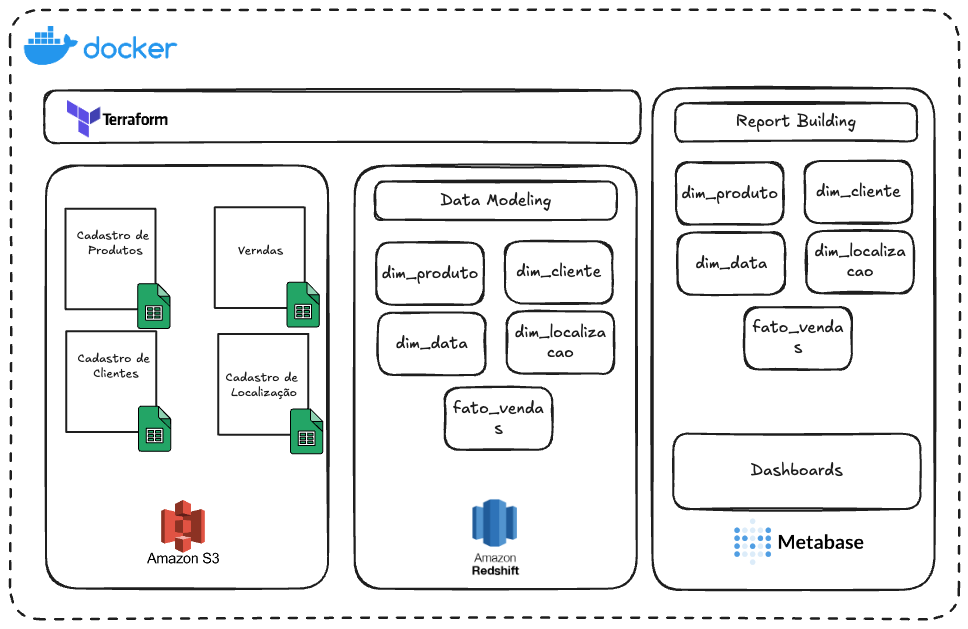

# Modeling a Data Warehouse for an Ecommerce Company using AWS, Metabase and Terraform

In this prooject I defined the following architecture to execute it.


## Context
A company in the e-commerce sector operates across various regions in Brazil, selling a variety of technology products, such as computers, smartphones, and peripherals. The company serves both corporate clients and individual consumers. The company is interested in monitoring and analyzing its sales to understand customer behavior, product performance, and regional trends over time.

### Objective:
The company aims to build a data analytics system that allows detailed collection and analysis of sales. This includes the ability to segment data by customer, location, product, and time period. The system should assist in strategic decision-making, such as launching new promotions, adjusting inventory, and expanding into new regions.

### Details of the Company’s Operations:
The company sells technology products to its customers, who may be either individual consumers or businesses. Each sale is associated with a specific customer and takes place in a specific geographic location. The system needs to record the product sold, the quantity, the sale price, and the cost of the product.

Further details about how this project was designed are availables in my [Article at Medium](https://www.medium.com/@data-menna)

## Tech Stack Used
- Python
- Docker
- Terraform
- Metabase
- Amazon S3
- Amazon Redshift
- Github

## Before Executing the Project
To execute this project, it is necessary to follow the following steps:

### Install Docker
[Install Docker for your OS](https://docs.docker.com/desktop/)

### Clone this Github repository
In your terminal:

Clone the repo using Github CLI or Git CLI
```
gh repo clone daniel-menna/dw-ecommerce
```
or

```
git clone https://www.github.com/daniel-menna/dw-ecommerce.git
```
Open the folder with your code editor.

## Preparing Everithing.
To run this project without any headake, it is necessary to follow few steps:

### Create a S3 Bucket
In your browser go to [https://aws.amazon.com//s3/](https://aws.amazon.com//s3/) and create a bucket, recomended something like: `ecommerce-dw-<YOUR-ID-AWS>`.

Copy your bucket name and save it for later.

### Generate your Data Source
In the project folder, you can generate your data source following these steps:
- Access the `src` folder;
- Run the Python script called `faker_datas.py`.
    ```
    python run faker_datas.py
    ```
    Note: It is necessary to have Python installed in your environment. If you don't want to run this script, you can find sample file in the `data` folder, in this repository.
- Create a folder `data` in you S3 Bucket and upload these files there.


### Build the project
Execute the following command in the terminal:
```
docker-compose up
```

